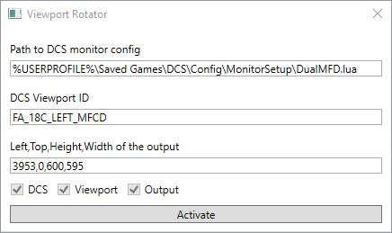

# What is this?

The `ViewportReplicator`, replicates a DCS World viewport and rotates it 180° to a specified region on the screen.

This is useful for DIY MFD screens using LCDs such as the CLAA070MA0ACW which must be rotated upside down for good image quality, but have a controller (PCB800099-v9) which does not respect the display orientation setting set by Windows.

Known alternatives to this option are:
+ [Helios](https://github.com/HeliosVirtualCockpit/Helios) with a "Screen Replicator", but this has much lower FPS & does not support placement in the same spot.
+ [Helios](https://github.com/HeliosVirtualCockpit/Helios) with a "Screen Replicator (Adjustable)", which might be faster, but likely also does not support placement in the same spot.


## How this works

It uses [Direct3DHook](https://github.com/justinstenning/Direct3DHook) to grab screenshots from the original viewport area from the DirectX "backbuffer".

Starting from the following `DualMFD.lua` monitor configuration:

```lua
_  = function(p) return p end
name = _('4K_DualMFD')
description = '4K main monitor with dual 800x600 MFDs to the right.'
-- DO NOT USE CALCULATED COORDINATES because the Viewport Rotator only uses regex..
FA_18C_LEFT_MFCD = { x = 3940, y = 0, width = 600, height = 595 }
FA_18C_RIGHT_MFCD = { x = 3960, y = 600, width = 600, height = 595 }
Viewports = {
  Center = {
    x = 0,-- The HORIZONTAL starting location of the main display
    y = 0,-- The starting VERTICAL position of the main display
    width = 3840,-- The HORIZONTAL size of the main display
    height = 2160,-- The VERTICAL size of the main display
    aspect = 3840 / 2160,-- The aspect ratio of the main display
    dx = 0,
    dy = 0
  }
}
UI = { x = 0, y = 0, width = 3840, height = 2160 }
UIMainView = UI
GU_MAIN_VIEWPORT = Viewports.Center
```

And these settings in the app:



It sreenshots the viewport in the original DCS output, marked in this screenshot by the yellow box.


After clicking `Activate`, the app window resizes & positions itself in the specified area, with an image showing the screenshots rotated by 180°:


The default values for the viewport ID, and output area are currently hard-coded to my setup, but if this is useful for someone I'm open to PRs that make changes persistent.
And if someone wants to do a PR to put this into Helios that'd be great too!
